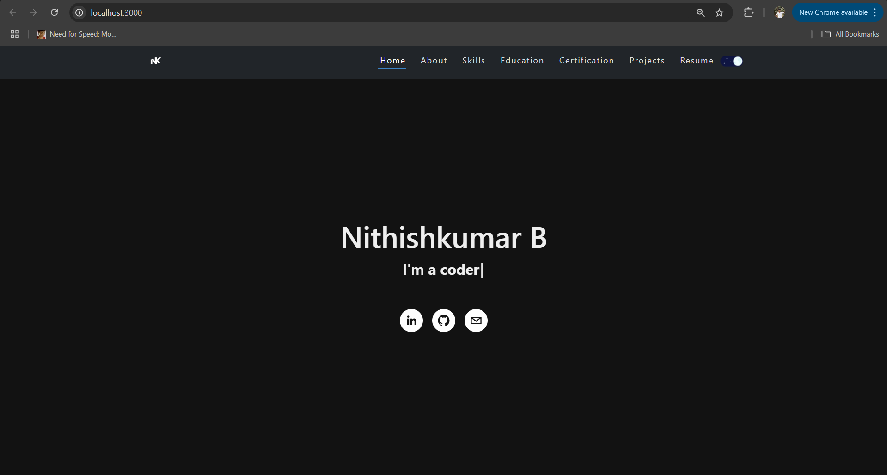

## My portfolio

This is my portfolio website built with React.js that helps to showcase my works and skills as a developer.

---

# Demo :movie_camera:

## View live preview [here](https://nithishkumarb.netlify.app/).

---

## Features

⚡️ Modern UI Design + Reveal Animations\
⚡️ Made with React\
⚡️ Fully Responsive\
⚡️ Easily Customizable\
⚡️ Well organized documentation

# Sections :bookmark:

- ABOUT ME
- CERTIFICATION
- SKILLS
- PROJECTS
- EDUCATION
- CONTACTS

## Running the Application
 
   - Open a new terminal and navigate to the `frontend` directory.
   - Install dependencies: `npm install`.
   - Start the frontend application: `npm run dev`.
   - The application should now be running on `http://localhost:3000`.

 **DEPLOYMENT**
 
   - Netlify is used for deployment
    
Netlify Demo : https://nithishkumarb.netlify.app/
 

**TOOLS USED**:
 

  
  
  
  
  
  
  

